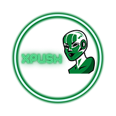

# Tokens

### PUSH - push.money Token

[Contract: 0x4cbD241e248e0545fc8AcF6338639988751b40e8](https://bscscan.com/address/0x4cbD241e248e0545fc8AcF6338639988751b40e8)

The PUSH token is designed to be used as a medium of exchange. The built-in stability mechanisms within the protocol aim to maintain PUSH's peg of 10,000 PUSH = 1 Bitcoin (BTC) in the long run.


Note that PUSH **actively pegs via an algorithm**, but that **does not mean** it will be valued at 10,000 PUSH to 1 BTC at all times as **it is not collateralized**. **PUSH is not to be confused for a crypto or fiat-backed stablecoin.**


### [xPUSH - PUSH Protocol Governance Token](xpush-push-staking.md)

Contract: [0xf07f73017103795Ed25f28733B34396E09419ad2](https://bscscan.com/address/0xf07f73017103795Ed25f28733B34396E09419ad2)

xPUSH is the governance token of PUSH Protocol. It can be obtained by staking PUSH.

Learn more about xPUSH on the [xPUSH - PUSH Staking page](xpush-push-staking.md).

### PSHARES - PUSH Shares

Contract: [0xdd7bD82ae6263cA3F9f973f5439f253Fe8CC1343](https://bscscan.com/address/0xdd7bD82ae6263cA3F9f973f5439f253Fe8CC1343)

PUSH Shares (PSHARE) are one of the ways to measure the value of the Push Money Protocol and shareholder trust in its ability to consistently maintain PUSH close to peg. During epoch expansions the protocol mints PUSH and distributes it proportionally to all PSHARE holders who have staked their tokens in the [**Boardroom**](boardroom.md).

PSHARE has a **maximum total supply of 70,001** tokens distributed as follows:

1. _Treasury/DAO Allocation: 5,500_ PSHARE vested linearly 12 months\*
2. _Team Allocation: 5,000_ PSHARE vested linearly over 12 months
3. _Rewards: 59,500_ PSHARE are allocated for incentivizing liquidity providers in two farming pools for 12 months
4. Initial mint: 1 PSHARE minted upon contract creation for the initial pool


The Push Money team will use the treasury funds in any way that they feel is best for the long-term success of the protocol.


### [P](pushes-mechanism.md)[BOND - PUSH Bonds](pushes-mechanism.md)

Contract: [0x](https://bscscan.com/address/0xdd7bD82ae6263cA3F9f973f5439f253Fe8CC1343)[667Dfce8b7ddF01921Aa41bb4685aA8424F894b4](https://bscscan.com/address/0x667Dfce8b7ddF01921Aa41bb4685aA8424F894b4)

The main purpose of PUSH Bonds (PBOND) is to help incentivize fluctuations in the PUSH supply during epoch contraction periods. When the TWAP (time-weighted average price) of PUSH falls below 10,000 to 1 BTC, PBONDs are issued and can be bought with PUSH at the current price. Exchanging PUSH for PBOND burns PUSH tokens, taking them out of circulation (deflation) and helps to get the price back up to peg. These PBOND can be redeemed for PUSH when the price is above peg in the future, plus a premium based on how high above peg we currently are. This conversely creates inflation and subsequent sell pressure for PUSH when it is above peg, helping to push it back toward 10,000 PUSH to 1 BTC ratio.


Unlike early algorithmic protocols, PBONDs do not have expiration dates.


All PBOND holders will be able to redeem their PBOND for PUSH tokens as long as the treasury has a positive PUSH balance, which typically happens when the protocol is in epoch expansion periods.
